# Mazes of Stampadia 3D

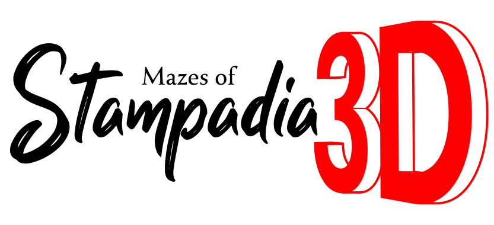

Print, cut, and delve into the darkness every day with your own eyes.

---

<a href="https://www.kesiev.com/stampadia-mazes">Play today's adventure</a> | <a href="https://www.kesiev.com/stampadia-mazes/learn.html">Learn how to play</a> | Read the manual: <a href="manuals/manual-EN.pdf">EN</a> | Play the tutorial: <a href="manuals/tutorial-EN.pdf">EN</a> | <a href="https://discord.gg/EDYP2N4RMn">Discord</a>

---

## The story

The Stampadia kingdom's oldest stories tell of a powerful artifact, stolen from the dungeons again and again by valiant Heroes.

Or at least, that's what we've managed to figure out. This time, we're as confused as you are.

    
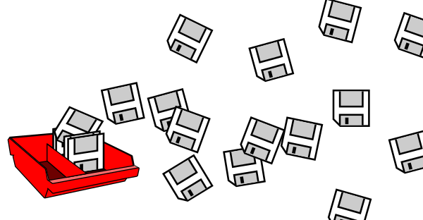

We found a large stock of boxes containing unlabeled floppy disks. Each contains a **single .Y file** that, in our opinion, stores a digital copy of an Ancient Stampadian's memory fragments: scattered images and moments of his attempted escape from the bowels of the earth, experienced through his own eyes.

Even these floppy disks seem imbued with Stampadia's strange magic: the reader can relive them firsthand with a token, some dice, and a pencil. But, this time, maybe with something else...

We apologize. Since these are memories and not written texts, we were unable to identify all the rules and the materials needed to play them and to create a reliable translator. We will provide you with the information exactly as we found it, and we'll share everything we've discovered so far.

We will share one of these **Memory Dumps** daily [here](https://www.kesiev.com/stampadia-mazes). Good luck!

## The game

**Mazes of Stampadia 3D** is a procedurally generated dungeon crawler you can print, cut, and play offline. Unlike the [first](https://github.com/kesiev/stampadia) and the [second](https://github.com/kesiev/stampadia-travelers/) Stampadia episodes, this time the view will not be from above but in first person, taking inspiration from old PC games like [Eye Of The Beholder](https://en.wikipedia.org/wiki/Eye_of_the_Beholder_(video_game)).

    
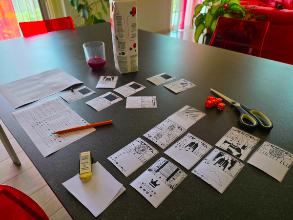

    
A game of Mazes Of Stampadia 3D

A new dungeon is available every day: cards full of strange glyphs to decode, dangerous fights, mysterious contraptions, strange characters, and many other surprises await you...

### Why?

_The planets have aligned_, and a worm that had been in my head for a long time has finally found peace.

### The project

#### The Worm

Ever since the first [Stampadia](https://github.com/kesiev/stampadia), I've been thinking about how to create a board game that simulates a first-person perspective. Specifically, I wanted to create something that recalled 90s first-person shooters like [Doom](https://en.wikipedia.org/wiki/Doom_(1993_video_game)) or early arena shooters like [Quake III Arena](https://en.wikipedia.org/wiki/Quake_III_Arena) and [Unreal Tournament](https://en.wikipedia.org/wiki/Unreal_Tournament).

Maybe "wanted" isn't the right word. I didn't have a specific gameplay idea in mind, so it was simply a mental exercise my brain occasionally played back.

The idea blinked several times randomly: in the shower, changing a shirt, while driving. It would appear, be kneaded for a few minutes without any results, and then disappear, swallowed up by something else.

#### The Preuk Effect

In October 2021, our trusty [Preuk](https://framapiaf.org/@Preuk) shared with me his first video game prototype for the [Rewtro](https://github.com/kesiev/rewtro) fantasy console. Rewtro games data are packed into QR-Codes, which can be printed in foldable cartridges or booklets and shared with friends. The amount of data available is very limited, so the virtual machine I implemented to run the games was intended for simple arcades. He managed to fit a first-person dungeon crawler [in a booklet](https://github.com/kesiev/rewtro/blob/master/markdown/game-prk001-dungeon.pdf) instead, blowing my mind forever.

    
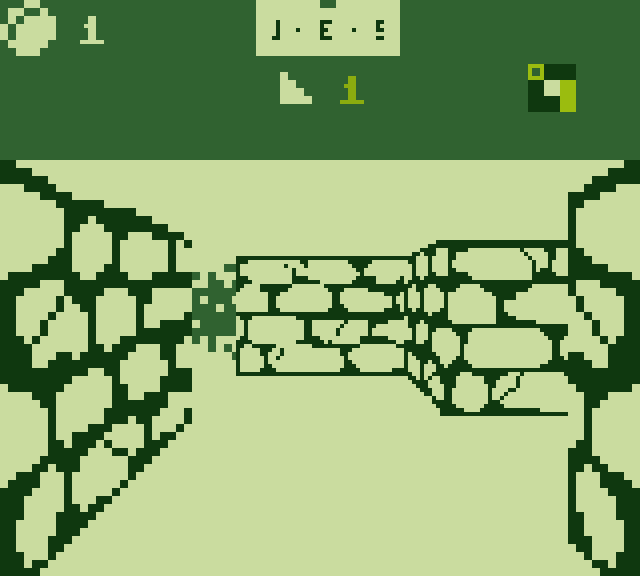

    
Dungeon by Preuk

This little game has served as a charm for a long time: no matter how hard I try to explore it, I will never truly know the limits of what I do. But there was something more behind its minimalist design. Something I would explore later...

In April 2024, the same trusty Preuk randomly pointed me out to [this article](https://paxsims.wordpress.com/2024/03/02/ace-of-aces-or-why-you-should-do-maths-as-a-game-designer/) about a 1980 gamebook called [Ace of Aces](https://en.wikipedia.org/wiki/Ace_of_Aces_(picture_book_game)) by Alfred Leonardi. It is composed of two illustrated books that show on different pages the first-person view of two airplane pilots. Jumping from page to page, two players maneuver their planes and shoot at each other.

    
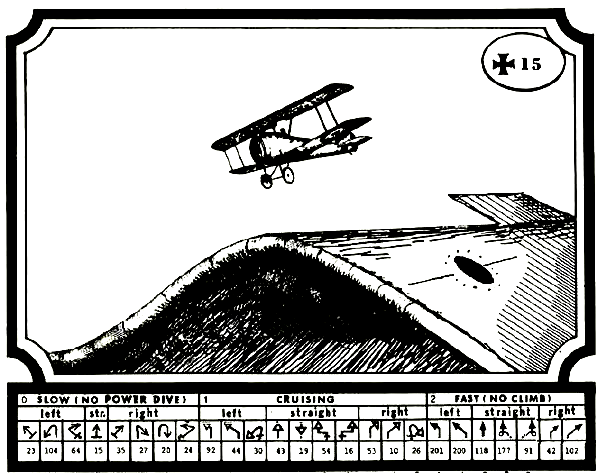

    
Ace of Aces by Alfred Leonardi

This game was a match for another gamebook I had come across during my studies for the first Stampadia: **White Warlord** and **Black Baron** by [Joe Dever](https://en.wikipedia.org/wiki/Joe_Dever). It plays the same way as Ace of Aces, but with a classic fantasy setting and a more complex dungeon.

    
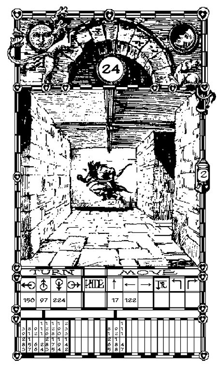

    
White Warlord by Joe Dever

White Warlock is a book of approximately 360 pages and allows you to explore a 6x8 dungeon. The idea of ​​using a gamebook to recreate this experience is brilliant, but it's not the kind of solution that fits the game components I had in mind: a deck of cards and a bare character sheet.

Furthermore, the dungeon's small size is perfect for the type of gameplay White Warlord offers: if it had been too large, it would have been difficult to meet your opponent. But in my mind, I didn't want to rule out the idea of ​​creating something larger to explore in a lunch break - the Stampadia formula.

#### Before Your Eyes

In 2025, Stonemaier Games releases [Vantage](https://boardgamegeek.com/boardgame/420033/vantage), a sandbox exploration game that lets you explore an entire planet in first person, moving from card to card _a la gamebook_.

    
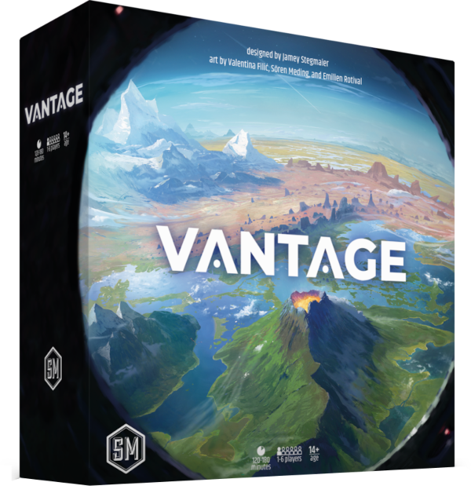

    
Vantage by Stonemaier Games

Although I speak English fairly well, translation always breaks the rhythm a bit, which is why I prefer to buy narrative games in Italian. So, despite my infinite curiosity to explore their design, I limited myself to admiring it in gameplay videos and reviews.

While White Warlord lets you explore a 6x8 dungeon in 360 pages, Vantage allows you to explore _a planet_ in 400 cards. It's a _meaty_ deck of cards, but... hey, _it's a planet_! So cool!

#### The Stampadia Videogame

From time to time, my wife **Bianca** asks me to make a **Chronicles of Stampadia** video game. What she likes is the surreal atmosphere it creates and the sense of adventure.

The game was built around its technical limitations: creating a hidden dungeon on a single sheet of A4 paper required several cuts to the narrative, forcing me to strip it down. So I created something reminiscent of role-playing game **oracles**: small, vague glimpses that help the reader project images into their mind. That sense of surrealism comes right from there.

How could I make this happen in a video game with the limited resources and time I have? After thinking about it, I abandoned the idea. But one thing was clear: if there were a video game **set** in Stampadia, it would be **a first-person dungeon crawler**. So, I started working on a video game _conceptually_ set in Stampadia but limited to small dungeons: [The Tomb Of The Architects](https://github.com/kesiev/ttota).

    
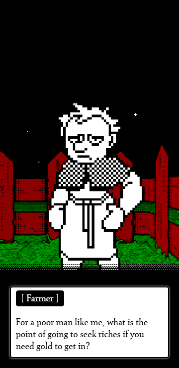

    
The Tomb Of The Architects by KesieV

The activities carried out in the Stampadia dungeons were essentially inspired by two elements: the combat system of gamebooks, shifted a little more towards the model of board games, and the activities typical of the action RPG genre, mixed for the occasion with the games usually printed in puzzle magazines.

So I asked our trusty Preuk to think of a combat system for TTOTA that would be reminiscent of a board game (i.e., turn-based and puzzly), while I researched which dungeon activities I could best adapt.

And, to the surprise of surprises, nothing went as planned. Preuk was swallowed up by other stuff, while the idea of ​​adapting Stampadia's activities was completely abandoned as they were far too simple for a video game and required a lot of graphics.

But all was not lost: 2021's Preuk little dungeon crawler had shown me something else. You can explore a dungeon without having to fight: sometimes, all you need to have fun is a maze and something interesting to find to motivate you to explore it.

So I took a lot of old computer games from the 80s and 90s, adapted them to turn-based gameplay (much like I did with [Cardcade](https://github.com/kesiev/cardcade)), and scattered them around procedurally generated dungeons. I had a lot of fun both making it and playing it!

    
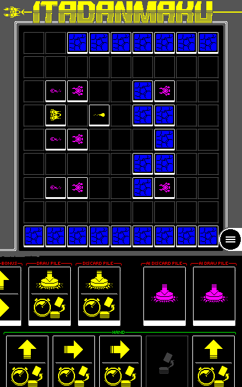

    
Itadanmaku (a card-based SHMUP) from the Cardcade collection by KesieV

One night, before going to bed, the idea occurred to me: "Cards aren't places, but textures." I could compress a rather complex maze into just a few cards, inspired by how 3D environments were stored in computer games. Furthermore, by numbering the cards and showing only the current view, I could hide the maze's layout.

During lunch break the next day, I set up the first iteration of the prototype, and the result wasn't bad. I just had to figure out how to reduce the movement of the cards around the table.

Or, at least, that's what I told myself. It took me over a month to refine the movement system alone. But it took much less time to realize that there was still a lot of work to do...

#### In True Plain Sight

Cutting the cards of a print-and-play game is an important ritual, on a par with sleeving cards in a board game.

The player comes into contact, albeit briefly, with the contents of the cards. Their eyes fall on the illustrations or descriptive text of a card, generating two distinct and subtle effects in the players. On the one hand, it anticipates the player's contact with the game elements, allowing them to better understand the rules and measure the decision-making space. On the other hand, it _spoils_ what the game might offer.

While some _advanced sleeving techniques_ may mitigate these effects, like the Sacred Art of Sleeving Cards _Looking at the Back of The Cards_, cutting them makes the peeking process inevitable. Also, this time, I decided not to use the backs of the cards as I did in [Travelers of Stampadia](https://github.com/kesiev/stampadia-travelers), in order to reduce setup time. So most of the cards are constantly face up on the table.

How could I hide the text and the illustrations on the cards - at least a little - if they were always face up? I decided to use a few vague illustrations and no text at all: everything, from the rules to the flavor text, would be expressed through symbols to be deciphered.

This would also have helped me mitigate several problems I encountered while developing previous installments: hiding text, too much space needed to describe the card rules, and translating the game into different languages.

And speaking of symbols, here's a secret for you, hidden in Stampadia for years. Here's _Stampadia Playground_, an alternative Stampadia sheet that **uses symbols**!

    
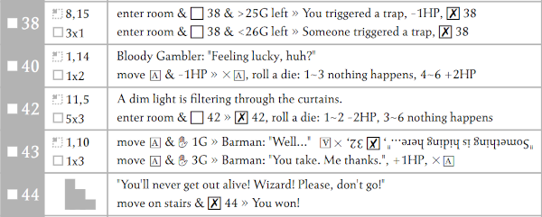

    
Chronicles of Stampadia (Playground) by KesieV

I've never liked the idea of ​​making the text a bit too hieroglyphic, so I didn't pursue it further. But this time, it's different: now I have enough space to print larger, more _extravagant_ symbols. Now the cards are almost illegible at a quick glance – at least, for long enough for a few games!

#### The Dungeon Platform

**The Tomb Of The Architects** helped consolidate a concept that always floats around near the Stampadia series games development end. The navigation, resources management, and memory systems of these games often turn out to act like a _platform_ for implementing _activities_, not too different from fantasy consoles or, more broadly, a game engine.

So _why not design the game like that from the very beginning_? The dungeon generation process quickly became designed as _a packer_: activities may _stick_ events on the dungeon walls, which are then packed and split into multiple cards automatically, trying to reuse them following a set of directives. The resource system became a _shared memory system_, in which activities may load and save the status - and even share some data using the player as an intermediary.

    

    
The Dungeon Platform...?

Some _specs_ started forming around the **Mazes of Stampadia 3D**, closely resembling those of a software platform: activities may use up to 2 cards (or 3 if all located at the same wall) and may use 5 resources and a shared set of keys. A _gate system_ may inject rules on walls, helping to spare more cards in some scenarios. Randomly selected one-card activities may be used to pad less demanding key activities and introduce more unpredictability. Any activity can use a set of API to read the dungeon, and write on cards, and even use the lower side of cards _as a canvas_ to create even unconventional interactions...

Using symbols for card rules, resources as a shared memory system, thinking of the dungeon generator as a packer, and allowing the activities to draw freely on cards helped to create a new layer of surreal lore to the game. **MOS3D** immerses the player in a strange and cryptic procedurally generated living machine. The line between game, player, and computer seems to blur... and I love it!

#### The Activities Quilt

I love exploring humans, from their masterpieces to their terrible errors. I like understanding their history, motivations, and philosophy. When I'm done, I create small _things_ to summarize them and remember them better. Most of my personal projects serve to give direction and purpose to this research and a container for these small artifacts. It's a wide and very vague scope, so maybe that's why these projects looks very random!

I usually prefer to _store_ many of them per project. It's something I do for pleasure and a project _is done when it's done_, so no number is scary. The first Stampadia had over 100 activities by the time it was completed so I wanted to challenge myself a little and release the same number on first release.

I decided to take a little more time than the usual on this project, just to see what happens to the end result.

I've also decided to direct my research towards three key objectives. The first is to reimplement and extend some of the activities from the first Stampadia to provide continuity to that universe. The second is to continue the journey into fantasy tropes, expanding the world of Stampadia. The third, inherited from TTOTA, is to create new demakes of classic games and explore the world of creative interactive activities.

Since this time it's an analog game, I was able to explore a different side of these games, typically touched on by my beloved tabletop escape rooms: pen and paper puzzles and the oldest board games. The design decision to exploit the lower half of the cards in unconventional ways was crucial in broadening the research spectrum!

    
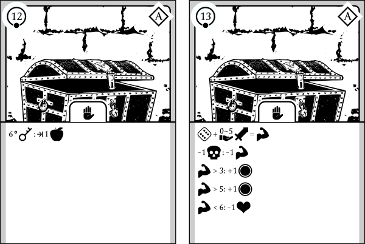

    
The chest on the left says: "if you have the 6th key in your inventory, gain 1 apple", so you're probably unlocking it to pick up its content. But what about the chest on the right? Wait, isn't that...

The result gave the game an aura of mystery that I found intriguing. Some activities feature walls of symbols that explain a procedure abstractly, as if it were a ritual, but by following them step by step, you find yourself making familiar gestures and decisions. Conversely, other activities feature few symbols but familiar graphic elements, reminiscent of games from the past. You might already know what's needed to solve them, or you might find the answer in real life, in books, or online.

This effect has actually been incorporated into the game's lore.

#### Wrapping up

I'm leaving this project to the Internet, hoping someone will enjoy it as much as I did. Let me know your thoughts on [Discord](https://discord.gg/EDYP2N4RMn), [Mastodon](https://mastodon.social/@Kesiev/), or [Bluesky](https://bsky.app/profile/kesiev.bsky.social). And if you've read this far, thank you so much!

### Images

Symbols and illustrations used in this game are a mix of Public Domain / CC0 images from [SVGSilh](https://svgsilh.com/) and [SVGRepo](https://www.svgrepo.com/) and custom graphics by KesieV.

### Font

The game manual and the cards are using the excellent CC0 fonts [Seshat](http://dotcolon.net/font/seshat/) by Dot Colon. If you're going to have a look at the manual generation tools `assets/manual/` and the adventure sheet model `svg/model.svg` make sure you have got these fonts installed. A copy of these fonts is included in the `assets` directory.
